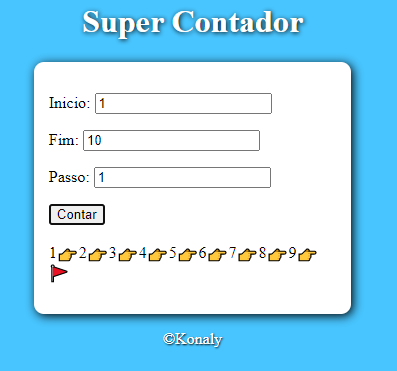
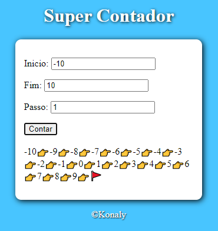

### 📚 Super contador!
#### Algoritimo simples que percorre de um numero x a um numero y com um passo variavel, pra cada numero percorrido um emoji surge acompanhado com o indice!

 

    
    
    

 

### Tratamento de erro ✅

 

    
    

### Tecnologias usadas 💻

